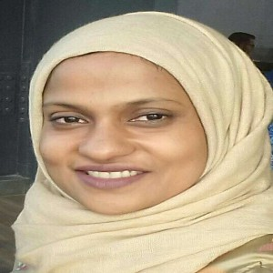
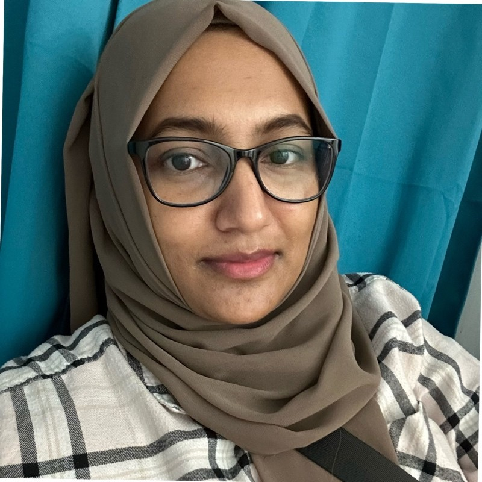

```{=html}
<header class="c-pagehead">
  <div class="c-wrap">
<h1>About the centre</h1>
    <p>
      CHIRAL Bangladesh — the Centre for Health Innovation, Research, Action and
      Learning — is an independent, volunteer-run research centre in Dhaka. We do
      computational health research, and we train undergraduate students to do it
      with us.
    </p>
  </div>
</header>

<section class="c-slab c-slab--paper">
  <div class="c-wrap">
    <div class="c-split">
      <div class="c-prose">

        <h2>Why the centre exists</h2>
        <p>
          In most countries a science student meets real research in their final
          year, if at all. In Bangladesh the gap is wider: the appetite is
          substantial, the supervision capacity is not. Talented students reach
          graduation having never designed a study, cleaned a dataset, or read a
          reviewer's report on their own work.
        </p>
        <p>
          CHIRAL was founded in 2020 to close that gap directly — not with lectures
          about research, but by putting first- and second-year students on real
          projects with real supervision, and keeping them there until something is
          published.
        </p>

        <h2>What we work on</h2>
        <p>
          Four groups, arranged along a single axis of scale: molecular data,
          patient records, predictive models, and geographic space. A tumour study
          may start in <a href="../groups/combio/">Computational Biology</a> and end in
          <a href="../groups/bio-ai/">Bio-AI</a>; a dengue study may span
          <a href="../groups/public-health-informatics/">Public Health &amp; Informatics</a>
          and <a href="../groups/geospatial-health/">Geospatial Health</a>. The
          groups organise supervision, not territory.
        </p>

        <h2>How we are run</h2>
        <p>
          Entirely by volunteers. Nobody is paid, and nobody pays to take part.
          Mentors are graduate students, postdocs, academics and industry data
          scientists who give a few hours a week. That model constrains how fast we
          can grow, and we accept the constraint deliberately: it keeps
          participation open to students who could not afford a fee-based
          programme.
        </p>

        <h2>What we commit to</h2>
        <ul>
          <li><strong>Students first-author their work.</strong> Supervision is not co-option.</li>
          <li><strong>Analyses are reproducible.</strong> Code and pipelines are version-controlled and, wherever the data licence permits, public.</li>
          <li><strong>Teaching material is open.</strong> Our bootcamp content stays free so the capacity remains in the region.</li>
          <li><strong>Limitations are stated.</strong> In a data-scarce setting, honest uncertainty is more useful than a confident number.</li>
        </ul>

        <h2>Governance &amp; affiliation</h2>
        <p>
          <span class="c-todo">To be completed</span> — legal registration status,
          advisory board, and institutional affiliations.
        </p>
        <!-- TODO(CHIRAL): state the centre's registration status, list the advisory
             board, and name institutional affiliations. This section is the first
             thing an international collaborator or funder will look for. -->

        <h2>Funding</h2>
        <p>
          <span class="c-todo">To be completed</span> — current and past funding
          sources, or an explicit statement that the centre operates unfunded.
        </p>
        <!-- TODO(CHIRAL): list grants and supporters, or state plainly that the
             centre is unfunded and volunteer-supported. Either is credible; an
             empty section is not. -->

      </div>

      <div class="c-aside">
        <dl class="c-facts">
          <dt>Founded</dt>
          <dd>2020</dd>

          <dt>Based in</dt>
          <dd>Azimpur, Dhaka 1205, Bangladesh</dd>

          <dt>Model</dt>
          <dd>Volunteer-run and non-profit. No fees charged, no stipends paid.</dd>

          <dt>Groups</dt>
          <dd>Computational Biology · Public Health &amp; Informatics · Bio-AI · Geospatial Health</dd>

          <dt>Working languages</dt>
          <dd>English and Bangla</dd>

          <dt>Contact</dt>
          <dd><a href="mailto:chiralbd@gmail.com">chiralbd@gmail.com</a></dd>
        </dl>

        <p style="margin-top:1.5rem">
          <a class="c-btn c-btn--dark" href="../people/">Meet the people</a>
        </p>
      </div>
    </div>
  </div>
</section>

<section class="c-slab c-slab--white">
  <div class="c-wrap">
    <div class="c-slab-head">
      <span class="c-eyebrow">Acknowledgement</span>
      <h2 class="c-h2">Where this began</h2>
    </div>
    <div class="c-prose">
      <p>
        CHIRAL exists because two teachers at the Department of Microbiology,
        Jagannath University, took undergraduate curiosity seriously before there
        was anything here to point to. Their encouragement in those first years
        — the questions asked, the time given, the belief that students could do
        real research — is the reason the centre was attempted at all. We record
        our deep gratitude to them.
      </p>
    </div>
    <div class="c-thanks">
      <div class="c-thanks-card">
        
        <div>
          <p class="c-thanks-name">Dr. Syeda Tasneen Towhid</p>
          <p class="c-thanks-role">
            Associate Professor · Department of Microbiology<br>Jagannath University
          </p>
        </div>
      </div>
      <div class="c-thanks-card">
        
        <div>
          <p class="c-thanks-name">Sabia Sultana</p>
          <p class="c-thanks-role">
            Assistant Professor · Department of Microbiology<br>Jagannath University
          </p>
        </div>
      </div>
    </div>
  </div>
</section>

<section class="c-slab c-slab--panel">
  <div class="c-wrap">
    <div class="c-slab-head">
      <span class="c-eyebrow">Get involved</span>
      <h2 class="c-h2">Three ways in</h2>
    </div>
    <div class="c-grid-3">
      <div>
        <h3 style="font-family:var(--c-display);font-size:1.05rem;margin:0 0 .5rem">As a student</h3>
        <p style="font-size:.92rem;line-height:1.65">Undergraduates in any relevant discipline, from first year onward. No prior coding required.</p>
        <a class="c-card-link" style="color:var(--c-green)" href="../opportunities/">Apply →</a>
      </div>
      <div>
        <h3 style="font-family:var(--c-display);font-size:1.05rem;margin:0 0 .5rem">As a mentor</h3>
        <p style="font-size:.92rem;line-height:1.65">Graduate students, postdocs, academics and industry researchers, supervising a small team.</p>
        <a class="c-card-link" style="color:var(--c-green)" href="../opportunities/#mentors">Volunteer →</a>
      </div>
      <div>
        <h3 style="font-family:var(--c-display);font-size:1.05rem;margin:0 0 .5rem">As an institution</h3>
        <p style="font-size:.92rem;line-height:1.65">Universities, hospitals and non-profits bringing a question, a dataset, or a joint proposal.</p>
        <a class="c-card-link" style="color:var(--c-green)" href="../collaborators/">Collaborate →</a>
      </div>
    </div>
  </div>
</section>
```
